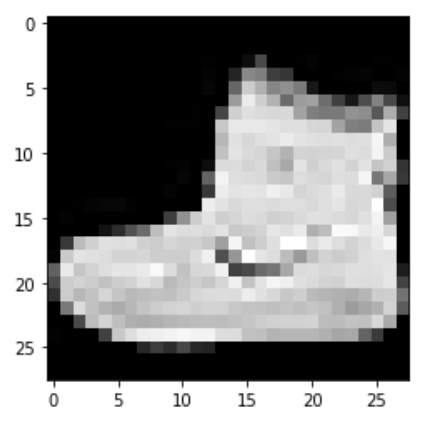

Getting Started
---------------

Here, you will be briefly guided through the package.

All libraries are in sub-directories of src/toolkit.

pipelines at a glance
^^^^^^^^^^^^^^^^^^^^^^^^^^^

For now, there are demos for 2 python library, pytorch and mnist.

For minist, we output a figure of the first item:

